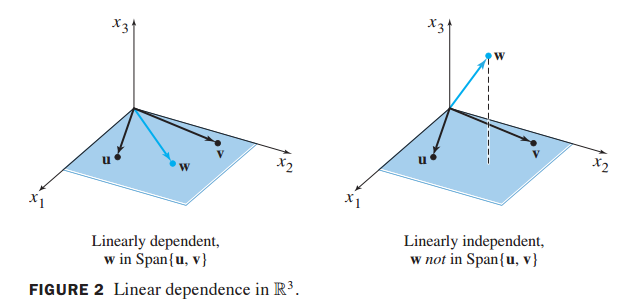

# 선형대수학 기초 한줄정리

### Linearly Independent란?

```markdown
선형 독립이란 벡터들이 서로 선형 관계로 표현될 수 없는 상태를 말합니다.
다시 말해, 벡터들이 선형 독립이라면 어떤 한 벡터를 다른 벡터들의 선형
조합으로 표현할 수 없습니다. 예를 들어, 만약 벡터들이 선형 독립이라면 
그들 각각이 서로 독립적인 방향을 가지고 있어야 합니다. 

만약 한 벡터가 다른 벡터들의 선형 조합으로 표현될 수 있다면,
그들은 선형 종속이라고 합니다.

V1,V2..Vn까지의 벡터의 집합이 있다고 가정하겠습니다.
여기서 선형결함 A1V1 + A2V2 ... AnVn의 값이 0 일때
A1 ~ An의 값이 모두 0인 경우 선형 독립이라고 할 수 잇습니다.
그리고 만약 그렇지 않은 경우는 선형 종속이라고 할 수 있습니다.
```


---

### Basis와 Dimension이란 무엇인가?

```markdown
벡터공간 V의 부분집합 S = {v1,v2,...vn} 에 대해서
S가 일차독립이고  span{S} = V
라는 두 조건을 만족하면 S를 V의 기저라고 부른다.

또 이 벡터공간 V의 한 기저의 개수가 n개일때 V의 차원을
기저의 개수가 차원이 됩니다.
```

---

### Symmetric Matrix란?

```markdown
대칭행렬이란 어떠한 행렬 A와 A transpose의 값이 같은
행렬을 말합니다.

A = AT : A = Symmetric Matrix
```

---

### Possitive-definite란?

```markdown
정치행렬이란 고윳값이 양수인 대칭행렬을 의미합니다.

Possitive definite matrix의 성질
- 주대각선의 우하향 방향으로의 Sub-Determinat들이 모두 양수이다.
- 모든 Pivot이 양수이다.
- 0이 아닌 벡터 X에 대해 Energy-based-Definition이 양수이다.
```

---

### Rank 란 무엇인가?

```makefile
Rank란 행렬이 가지는 independent한 column의 수를 말합니다.
그 말은 다시 말해 column space의 dimmension을 말하며
col-rank와 row-rank는 같다는 성질이 있습니다.

임의의 행렬 A가 있을 때, 이 행렬의 Rank 라는 것은 이 행렬의 
열들로 생성될 수 있는 벡터 공간의 차원을 의미한다
```

### Linear Combination (선형결합) 의 기하학적 의미
linear combination은 어떤 벡터들에 스칼라배를 하고 그것을 더하는 것을 의미합니다.
이렇게 나온 값이 independent 한지에 따라서 주어진 벡터들이 span 할 수 있는 vector space를
정의할 수 있습니다
1. 만약 한 벡터로 생성 할 수 있는 공간이라면 1차원 (선)
2. 2개의 independent한 벡터가 있다면 2차원 (평면)
3. 3개의 independent한 벡터가 있다면 3차원 (입체 - 3차원)
을 생성할 수 있게 됩니다.

즉 선형결합은 주어진 벡터들이 span 할 수 있는 모든 점의 집합을 기하학적으로 나타낸다고 볼 수 있습니다.

### linearly independent 확인 (독립 종속 확인법)
양변에 상수를 각각 곱해줬을때 0이 나오는 0이 아닌 알파와 베타가 존재 하는지로 판별 가능
ax + by = 0
0이 아닌 알파와 베타가 존재한다면 종속(dependent)이다.
linearly independent를 통해 몇 차원을 span 할 수 있는지 확인할 수 있음.

### basis (기저)
어떤 공간을 이루는 필수적인 구성요소로 vector space를 span하는 linearly independent 한 어떤 벡터들을 뜻합니다.

### column space
어떠한 vector의 열들이 span 할 수 있는 space다

### Determinant = 행렬식
A = [a,b,c,d] 일때 detA = ad-bc
행렬식의 기하학적 의미는 기존의 좌표계에서 얼마만큼을 기울이거나 찌그러 트리는지 즉 면적 또는 부피의 scaling을 말합니다.

행렬식 determinant의 결과 부호에 따라 의미가 다른데
부호가 양수일 경우 : 변환 후 공간의 방향(오리엔테이션)이 유지됨 = 기저벡터의 반시계방향 순서가 유지됨
부호가 음수일 경우 : 변환 후 공간의 방향 (오리엔테이션)이
뒤집힘 (기저벡터의 순서가 반대방향으로 변함)을 뜻합니다.

또 행렬식 (determinant)의 값이 0인 경우 선형 변환으로 공간의 차원을 축소 시킴을 의미합니다. 즉 기저벡터가 lineaerly dependent가 되어 변환 결과가 0차원 공간으로 축소 됨을 의미합니다.

만약 0이 아닌 경우라면 그 행렬은 linearly independent 하며 역행렬이 존재한다는 것을 알 수 있습니다.
2x2 행렬식 = 평행사변형의 넓이 
3x3 행렬식 = 평행육면체의 부피